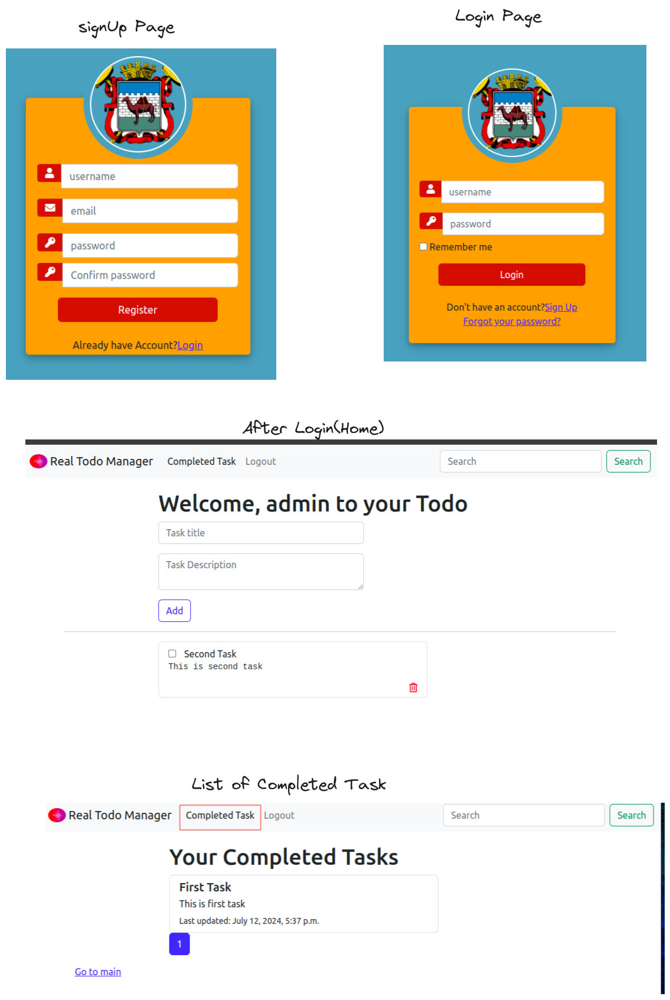

# Todo Task API Framework

## Quick Start Guide

### Step 1: Clone the Repository

Clone the repository to your local machine with the following command:
```bash
git clone https://github.com/realsanjeev/Todo-App-rest-framework.git
cd Todo-App-rest-framework
```

### Step 2: Set Up the Virtual Environment and Install Dependencies

Inside the project directory, create a virtual environment and install the required dependencies:
```bash
python3 -m venv venv
source venv/bin/activate  # For macOS/Linux
pip install -r requirements.txt
```

### Step 3: Set Up and Launch the Django Application

Go to the `todo_task` directory, apply migrations, and start the development server:
```bash
cd todo_task
python manage.py migrate
python manage.py runserver
```

### Step 4: Accessing the Application

To access the application features, open your web browser and go to:
```
http://localhost:8000/
```

For API functionality, use the following endpoint(sample testing is in `client` dir to test api):
```
http://localhost:8000/api/
```

### Step 5: Testing API Functionality

Explore different REST API functionalities using the `client` directory provided for testing purposes.

## Todo Task API 

The **Todo Task API Framework** provides robust API responses tailored for seamless integration with front-end web applications, such as React.js projects. It utilizes `rest_framework` to enable essential features:

**1. Authentication**: Secure interactions are ensured through token-based authentication, leveraging `rest_framework`'s authentication system.

**2. CRUD Operations**: Authenticated users can perform Create, Read, Update, and Delete (CRUD) operations. Customizable permissions and authentication settings cater to specific project needs.

**3. Pagination**: Built-in pagination optimizes data transfer, enhancing user experience by efficiently managing large datasets between the backend and frontend.

**4. Search Functionality**: Users can easily search for specific records using query parameters, improving data retrieval efficiency.

**5. Dedicated API Endpoints**: Each operation is supported by dedicated API endpoints, facilitating direct interaction between the frontend application and backend API.


## Todo App

The Todo App is a task management application designed for creating, deleting, and tracking task completion status. It combines basic frontend functionality with additional features accessible through its REST API.


### Key Features:

1. **Add Task**
   - Users can create new tasks by specifying a title and optional description.

2. **Delete Task**
   - Tasks can be removed from the list as needed.

3. **Mark Task as Completed**
   - Users have the option to mark tasks as completed, aiding in tracking progress.

> If you only want rest_api service remove `todo_apps` from settings and delete `myapp` dir.

## Contributing

Contributions are welcome! If you find any issues or want to add new features, feel free to submit a pull request.

## Contact Me

<table>
  <tr>
    <td></td>
    <td></td>
    <td></td>
    <td></td>
  </tr>
</table>
